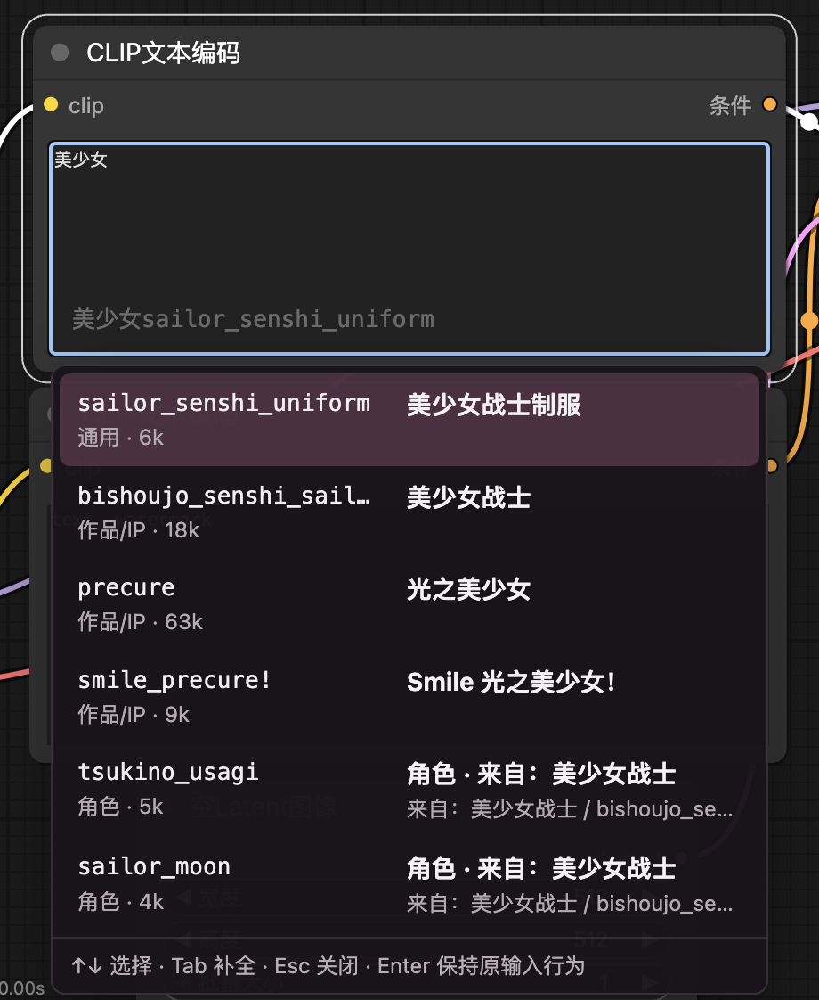
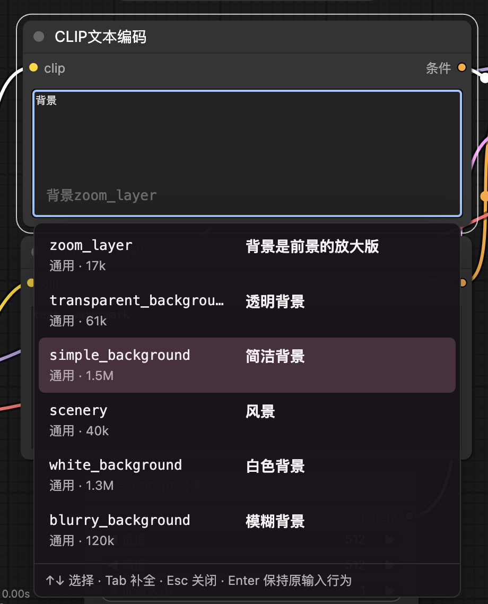

# ComfyUI Lite Tag Grimoire

ComfyUI Lite Tag Grimoire 是一个轻量的 ComfyUI Danbooru Tag 中文补全插件。

它不会替你生成整段 prompt，也不会把中文写进 prompt。它做的事情很专注：在 ComfyUI 的文本输入框里，用中文或英文搜索 Danbooru tag，然后用 `Tab` 补全为模型更容易理解的英文 tag。

## 预览





## 功能特点

- 中文/英文双向搜索 Danbooru tag。
- 输入中文描述，补全英文 tag，例如 `背景` 可以命中 `simple_background`、`white_background`。
- 输入作品/IP 名称，能索引到对应作品和角色列表，例如 `舰C`、`舰队收藏`、`kantai_collection`。
- 候选列表分成两栏：左侧是实际插入的英文 tag，右侧是中文翻译或角色来源说明。
- 角色项显示来源作品，例如 `sailor_moon` 会显示 `角色 · 来自：美少女战士`。
- `Tab` 接受补全，`Enter` 保留 ComfyUI 原本输入行为。
- `↑` / `↓` 选择候选，选中项会自动滚动到可见区域。
- `Ctrl` / `Command` / `Shift` / `Option` 加上下键不会被插件拦截，避免和 ComfyUI 的权重调整快捷键冲突。
- 首次聚焦或输入时才加载索引，不额外拖慢 ComfyUI 启动。
- 不新增 ComfyUI 节点，只作为前端输入增强工具运行。

## 安装

安装前请先确认你已经安装了 ComfyUI，并且知道自己的 `ComfyUI/custom_nodes` 目录位置。

### Windows

大多数 Windows 用户可以在 ComfyUI 目录下打开 PowerShell，然后执行：

```powershell
cd .\custom_nodes
git clone https://github.com/ICE6332/ComfyUI-Lite-Tag-Grimoire.git
```

如果你的 ComfyUI 在其他路径，请先进入对应目录，例如：

```powershell
cd C:\ComfyUI\custom_nodes
git clone https://github.com/ICE6332/ComfyUI-Lite-Tag-Grimoire.git
```

然后重启 ComfyUI。

### macOS / Linux

在终端中进入 ComfyUI 的 `custom_nodes` 目录：

```bash
cd /path/to/ComfyUI/custom_nodes
git clone https://github.com/ICE6332/ComfyUI-Lite-Tag-Grimoire.git
```

然后重启 ComfyUI。

### 不会用 Git

也可以直接下载 ZIP：

1. 打开 <https://github.com/ICE6332/ComfyUI-Lite-Tag-Grimoire>。
2. 点击 `Code`。
3. 选择 `Download ZIP`。
4. 解压到 `ComfyUI/custom_nodes/ComfyUI-Lite-Tag-Grimoire`。
5. 重启 ComfyUI。

请注意：文件夹最终应该长这样：

```text
ComfyUI/
  custom_nodes/
    ComfyUI-Lite-Tag-Grimoire/
      __init__.py
      web/
      data/
      README.md
```

## 使用方法

打开 ComfyUI，点击 prompt 文本输入框，然后直接输入中文或英文。

示例：

```text
背景
美少女
舰C
blue archive
miku
long hair
```

候选出现后：

- `↑` / `↓`：移动选择。
- `Tab`：插入当前选中的英文 tag。
- `Esc`：关闭候选。
- `Enter`：保持输入框原本行为，不接受补全。
- 鼠标点击候选：插入该英文 tag。

插入结果会保持 Danbooru 英文 tag，例如：

```text
simple_background, sailor_senshi_uniform, hatsune_miku,
```

## 数据内容

插件使用仓库内的本地 CSV 数据，不依赖在线搜索：

- `data/translations/danbooru_cn_preferred_v3.csv`
  - 通用描述 tag 中文翻译表。
  - 例如发色、表情、背景、服装、构图等。
- `data/translations/danbooru_copyright_cn_preferred_v1.csv`
  - 作品/IP tag 中文校对表。
  - 覆盖常见动画、游戏、手游、VTuber、二游等作品名。
- `data/sources/noob-wiki/danbooru_character.csv`
  - 角色索引。
  - 插件会把角色所属作品和作品中文名合并到候选展示里。

当前索引规模约为：

```text
通用 tag：3000
作品/IP：280
角色：60000
总计：63280
```

## 工作方式

ComfyUI 加载本插件后会：

1. 通过 `__init__.py` 注册前端扩展目录 `web/`。
2. 提供本地索引接口。
3. 前端脚本 `web/tag_autocomplete.js` 自动挂载到文本输入框。
4. 用户输入时在浏览器内完成搜索、排序和补全。

本地接口：

```text
/api/lite-tag-grimoire/index
/api/lite-tag-grimoire/health
```

排序策略大致为：

1. 通用描述 tag 优先。
2. 作品/IP 其次。
3. 角色最后。
4. 同类型内再按匹配程度和 Danbooru 热度排序。

这样可以避免输入常见描述时角色结果过早挤占候选列表。

## 验证安装

启动 ComfyUI 后，可以用下面的地址检查插件是否加载：

```text
http://127.0.0.1:8188/api/lite-tag-grimoire/health
```

如果你熟悉命令行，也可以执行：

```bash
curl http://127.0.0.1:8188/api/lite-tag-grimoire/health
```

正常会看到类似：

```json
{
  "ok": true,
  "counts": {
    "total": 63280,
    "general": 3000,
    "copyright": 280,
    "character": 60000
  }
}
```

## 更新

进入插件目录后拉取最新代码：

### Windows

```powershell
cd C:\ComfyUI\custom_nodes\ComfyUI-Lite-Tag-Grimoire
git pull
```

### macOS / Linux

```bash
cd /path/to/ComfyUI/custom_nodes/ComfyUI-Lite-Tag-Grimoire
git pull
```

更新后重启 ComfyUI，并刷新浏览器页面。

## 常见问题

### 输入中文后没有候选

请先刷新 ComfyUI 页面。如果仍然没有候选，确认插件目录是否放在 `custom_nodes` 下，并检查 ComfyUI 启动日志里是否出现了 `ComfyUI-Lite-Tag-Grimoire`。

### 修改 CSV 后没有生效

后端索引在 ComfyUI 进程内有缓存。修改 CSV 后需要重启 ComfyUI，再刷新浏览器页面。

### 为什么插入的是英文 tag？

大多数 Danbooru 风格模型更熟悉英文 tag。这个插件把中文作为搜索和显示辅助，最终插入英文 tag，方便模型理解。

### 为什么角色名没有被翻译？

角色名不强行机器翻译。没有可靠中文名时，插件会保留原始 Danbooru tag，并显示它来自哪个作品/IP。

## 设计取舍

这个插件刻意保持轻量：

- 不做云端搜索。
- 不依赖数据库。
- 不改变 ComfyUI 工作流格式。
- 不自动生成整段 prompt。
- 不自动把 prompt 转成中文。
- 不把角色名强行机器翻译成中文。

中文主要用于搜索和显示；真正进入 prompt 的仍然是英文 Danbooru tag。

## 适用场景

适合：

- 使用 Danbooru / NoobAI / Pony / Illustrious 等 tag 风格模型。
- 想在 ComfyUI 里用中文快速找 tag。
- 需要作品/IP 和角色 tag 辅助索引。
- 想要一个比复制 tag 表更顺手、但又不臃肿的输入增强。

不适合：

- 想让插件自动写完整 prompt。
- 想把所有 tag 输出成中文。
- 想做在线百科查询或大模型推荐。

## License

代码部分使用 MIT License。详见 [LICENSE](LICENSE)。

数据部分来自本地整理源和公开 tag 索引。请在再分发数据时自行确认对应数据源的许可与署名要求。
